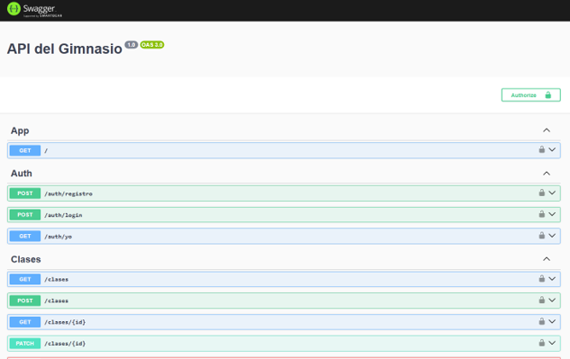
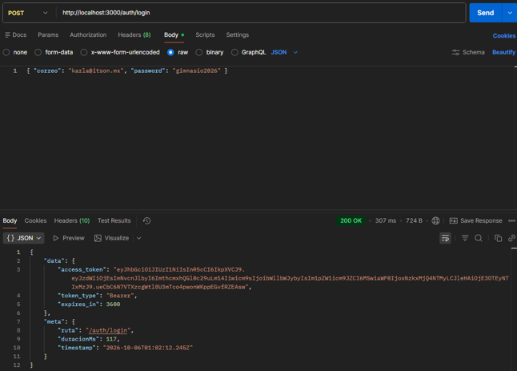
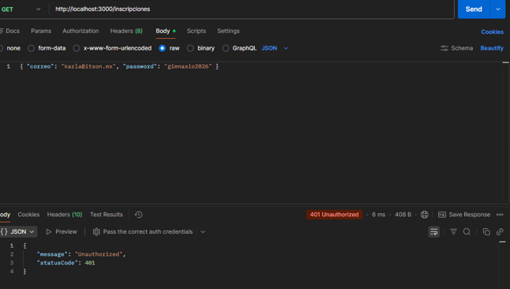
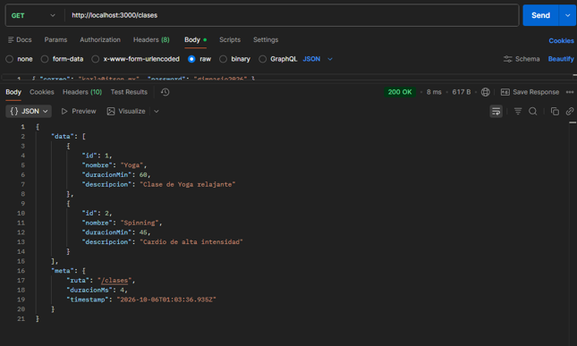
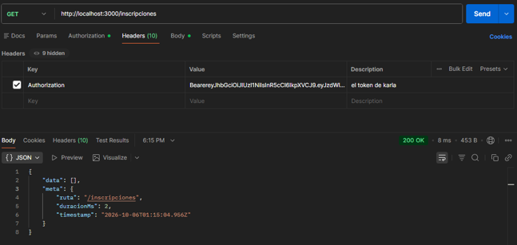
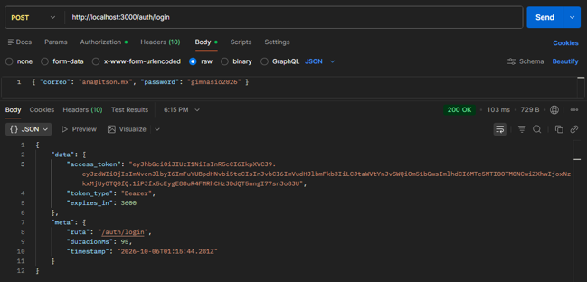
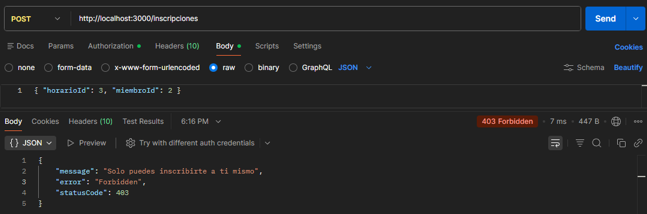
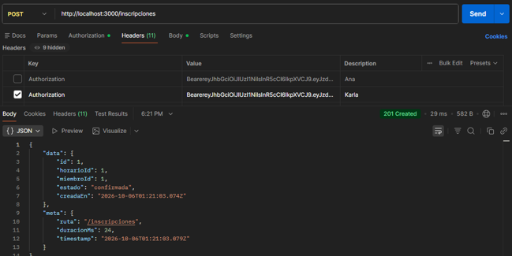
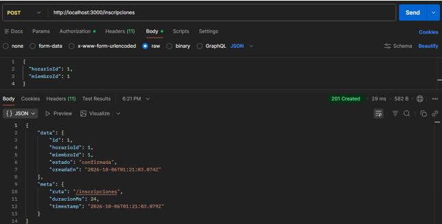

# Evidencias — Práctica 10: Autenticación JWT

## 1. Swagger UI — Rutas de la API

Swagger publicado en `/docs` mostrando todos los grupos de rutas: `App`, `Auth`, `Clases`, `Horarios` e `Inscripciones`. El candado en cada ruta indica que el guardia JWT está activo globalmente.

---

## 2. Login de Karla — 200 OK con Token

`POST /auth/login` con las credenciales de `karla@itson.mx`. La respuesta incluye el `access_token` (JWT firmado), `token_type: "Bearer"` y el sobre `{ data, meta }`.

---

## 3. Ruta Protegida sin Token — 401 Unauthorized

`GET /inscripciones` sin cabecera `Authorization`. El `JwtAuthGuard` global rechaza la petición con **401 Unauthorized** antes de que llegue al controlador.

---

## 4. Ruta Pública sin Token — 200 OK

`GET /clases` sin cabecera `Authorization`. Como la ruta tiene el decorador `@Publico()`, el guardia la deja pasar y devuelve **200 OK** con las dos clases del seed dentro del sobre `{ data, meta }`.

---

## 5. Ruta Protegida con Token — 200 OK con Sobre

`GET /inscripciones` con el token de Karla en el header `Authorization: Bearer ...`. El guardia valida la firma y permite el acceso. La respuesta viene envuelta en el sobre `{ data: [], meta: { ruta, duracionMs, timestamp } }`.

---

## 6. Login de Ana (Entrenadora) — 200 OK con Token

`POST /auth/login` con `ana@itson.mx`. Ana tiene rol `entrenador` dentro del payload del token, lo que le dará más permisos que a Karla en las siguientes peticiones.

---

## 7. Karla intenta inscribir a otro Miembro — 403 Forbidden

`POST /inscripciones` con el token de Karla (`miembroId: 1`) pero enviando `{ horarioId: 3, miembroId: 2 }`. El controlador detecta que el `miembroId` del token no coincide con el del cuerpo y lanza **403 Forbidden** con el mensaje `"Solo puedes inscribirte a ti mismo"`.

---

## 8. Karla se inscribe a sí misma — 201 Created

`POST /inscripciones` con el token de Karla y `{ horarioId: 1, miembroId: 1 }`. Karla se inscribe a **su propio** ID, la validación pasa y se devuelve **201 Created** con la inscripción creada dentro del sobre.

---

## 9. Ana inscribe a otro Miembro — 201 Created

`POST /inscripciones` con el token de Ana (rol `entrenador`) y `{ horarioId: 1, miembroId: 1 }`. Al ser entrenadora, la validación de identidad no aplica y puede inscribir a cualquier miembro. La respuesta es **201 Created**, comprobando que el rol `entrenador` tiene más permisos que `miembro`.
